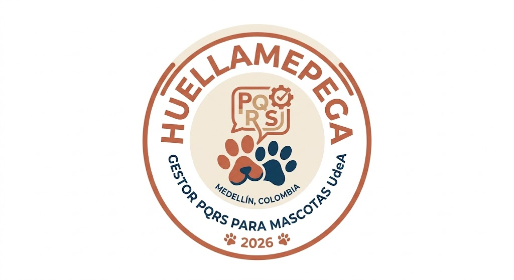
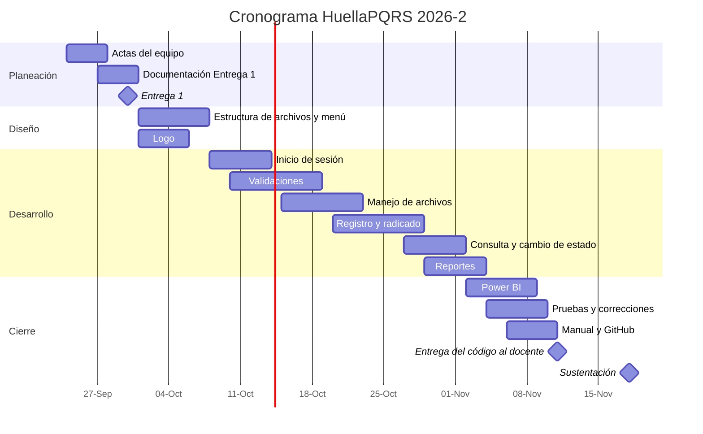

<!-- ============================================================
     GUÍA RÁPIDA (borra este bloque antes de entregar)
     - Todo lo que dice [COMPLETAR] lo tiene que llenar el equipo.
     - "HuellaPQRS" es un nombre de ejemplo: cámbienlo si quieren.
     - La imagen del logo debe quedar en la carpeta images/ con el
       nombre logo.png (o cambien la ruta abajo).
     ============================================================ -->

  

<h1 align="center">🐾 HuellaPQRS</h1>

<i>Gestor de Peticiones, Quejas, Reclamos y Sugerencias para MEPEGA</i>

  Proyecto Integrador · Algoritmia y Programación 2026-2 · Universidad de Antioquia 
  Docente: Victor Hugo Mercado Ramos

---

## 📑 Tabla de contenido

1. [Integrantes](#1-integrantes)
2. [Vínculos académicos y descripción](#2-vínculos-académicos-y-descripción)
3. [Nombre del proyecto y detalles](#3-nombre-del-proyecto-y-detalles)
4. [Licencia del software](#4-licencia-del-software)
5. [Reporte de visión](#5-reporte-de-visión)
6. [Especificación de requisitos](#6-especificación-de-requisitos)
7. [Plan de proyecto](#7-plan-de-proyecto)

---

## 1. Integrantes

| # | Nombre completo | Rol en el equipo | Correo institucional |
|---|-----------------|------------------|----------------------|
| 1 | [COMPLETAR] | Líder del proyecto / administrador del repositorio | [COMPLETAR]@udea.edu.co |
| 2 | Maribel Acevedo Serna | [COMPLETAR] | maribel.acevedo@udea.edu.co |
| 3 | [COMPLETAR] | [COMPLETAR] | [COMPLETAR]@udea.edu.co |
| 4 | [COMPLETAR] | [COMPLETAR] | [COMPLETAR]@udea.edu.co |
| 5 | [COMPLETAR o borrar esta fila si son 4] | [COMPLETAR] | [COMPLETAR]@udea.edu.co |

**Descripción del equipo:** somos un grupo de estudiantes de pregrado de la Universidad de Antioquia que se unió para desarrollar un programa en Python que ayude al Movimiento Estudiantil de Perritos y Gaticos (MEPEGA) a registrar y hacer seguimiento a las PQRS relacionadas con la atención veterinaria de perros y gatos en la universidad.

> Roles sugeridos: Líder (coordina y maneja GitHub), Desarrollo (programa los módulos), Datos y reportes (estadísticas y Power BI), Documentación y pruebas (manual, requisitos y revisión del programa).

---

## 2. Vínculos académicos y descripción

### 👤 [COMPLETAR: Nombre integrante 1]
- **Programa académico:** [COMPLETAR]
- **Habilidades:** [COMPLETAR, ej.: programación en Python, trabajo en equipo]
- **Fortalezas:** [COMPLETAR, ej.: organización, liderazgo]

### 👤 Walys Vera Herrera
- **Programa académico:** Estadística
- **Habilidades:** [COMPLETAR, ej.: análisis de datos, estadística descriptiva, manejo de bases de datos]
- **Fortalezas:** [COMPLETAR]

### 👤 [COMPLETAR: Nombre integrante 3]
- **Programa académico:** [COMPLETAR]
- **Habilidades:** [COMPLETAR]
- **Fortalezas:** [COMPLETAR]

### 👤 [COMPLETAR: Nombre integrante 4]
- **Programa académico:** [COMPLETAR]
- **Habilidades:** [COMPLETAR]
- **Fortalezas:** [COMPLETAR]

### 👤 [COMPLETAR: Nombre integrante 5, si aplica]
- **Programa académico:** [COMPLETAR]
- **Habilidades:** [COMPLETAR]
- **Fortalezas:** [COMPLETAR]

---

## 3. Nombre del proyecto y detalles

**Nombre:** HuellaPQRS

**¿Por qué este nombre?** Cada solicitud que llega a MEPEGA deja una "huella": queda registrada, tiene un número propio y se le hace seguimiento hasta que se soluciona, igual que las huellas de los perritos y gaticos a los que busca ayudar.

**Descripción corta:** HuellaPQRS es un programa de consola hecho en Python que permite a los administradores de MEPEGA registrar, consultar y actualizar las Peticiones, Quejas, Reclamos y Sugerencias sobre la atención veterinaria de perros y gatos en la UdeA. Guarda la información en archivos de texto, genera un comprobante (radicado) por cada solicitud, controla los plazos de respuesta y produce estadísticas para tomar mejores decisiones.

  

---

## 4. Licencia del software

Este proyecto se publica bajo la licencia **Creative Commons Atribución-NoComercial-CompartirIgual 4.0 Internacional (CC BY-NC-SA 4.0)**.

Esto significa que cualquier persona puede:

- **Compartir:** copiar y redistribuir el programa.
- **Adaptar:** modificarlo y construir sobre él.

Siempre que cumpla estas condiciones:

- **Atribución (BY):** debe dar crédito a los autores de HuellaPQRS.
- **No comercial (NC):** no puede usarlo para ganar dinero.
- **Compartir igual (SA):** si lo modifica, debe publicar su versión con esta misma licencia.

Elegimos esta licencia porque es un proyecto académico y sin ánimo de lucro: queremos que otros estudiantes puedan aprender de él, pero no que alguien lo venda.

---

## 5. Reporte de visión

### 5.1 Problema
MEPEGA recibe PQRS por muchos medios (redes sociales, correo, papel, voz a voz) y hoy las registra a mano, con papel y lápiz. Esto provoca que:
- Se pierdan solicitudes o se repitan números de radicado.
- Sea difícil saber cuáles solicitudes están por vencer o ya vencieron.
- No haya datos organizados para saber qué campus, canales o tipos de mascota generan más solicitudes.

### 5.2 Solución propuesta
HuellaPQRS es un programa de consola, sencillo y fácil de usar, que reemplaza el registro en papel. El administrador inicia sesión con usuario y contraseña y desde un menú puede registrar una PQRS, consultarla, cambiar su estado y ver estadísticas.

### 5.3 Objetivo general
Desarrollar en Python un programa de consola que permita a MEPEGA gestionar sus PQRS de forma ordenada, segura y trazable, usando archivos planos para guardar la información.

### 5.4 Objetivos específicos
1. Controlar el acceso al sistema mediante un inicio de sesión con usuario y contraseña.
2. Registrar las PQRS validando que cada dato esté completo y en el formato correcto.
3. Asignar a cada PQRS un número de radicado consecutivo y sin repeticiones, separado por tipo de solicitud.
4. Generar un comprobante (radicado) en formato de texto para cada PQRS registrada.
5. Calcular la fecha máxima de respuesta y alertar sobre las solicitudes próximas a vencer.
6. Producir estadísticas y un tablero en Power BI para apoyar la toma de decisiones.

### 5.5 Usuarios del sistema
| Usuario | Qué hace |
|---------|----------|
| Administrador de MEPEGA | Inicia sesión, registra, consulta y actualiza PQRS y revisa estadísticas. |
| Solicitante (ciudadano, estudiante, docente, administrativo) | No usa el programa directamente: es quien presenta la PQRS y recibe el radicado. |

### 5.6 Beneficios
- **Orden:** cada solicitud queda guardada con un número único.
- **Control de tiempos:** se sabe cuándo vence cada PQRS.
- **Menos errores:** el programa revisa los datos antes de guardarlos.
- **Mejores decisiones:** las estadísticas muestran dónde está la mayor demanda.
- **Trazabilidad:** queda registrado qué usuario ingresó cada solicitud.

### 5.7 Alcance
**Incluye:** inicio de sesión, registro, consulta y cambio de estado de PQRS, radicado en TXT, estadísticas y tablero en Power BI.
**No incluye:** página web, aplicación móvil, envío automático de correos ni base de datos en la nube.

---

## 6. Especificación de requisitos

### 6.1 Requisitos funcionales (lo que el programa **hace**)

| ID | Nombre | Descripción |
|----|--------|-------------|
| RF-01 | Iniciar sesión | El sistema debe pedir usuario (o correo institucional) y contraseña y compararlos con un archivo de usuarios autorizados antes de mostrar el menú. |
| RF-02 | Bloquear por intentos fallidos | Después de 3 intentos fallidos, el sistema debe bloquear el acceso durante [COMPLETAR: ej. 60] segundos y mostrar en pantalla el tiempo que falta. |
| RF-03 | Guardar sesión activa | El sistema debe recordar qué usuario inició sesión para asociarlo automáticamente a cada PQRS que registre. |
| RF-04 | Mostrar menú principal | El sistema debe mostrar un menú con las opciones: Registrar PQRS, Consultar PQRS, Registrar cambio en PQRS, Estadísticas y Salir. |
| RF-05 | Registrar PQRS | El sistema debe pedir los datos del solicitante, de la solicitud, de la mascota y del campus, y guardarlos en el archivo que corresponda a su tipo. |
| RF-06 | Validar datos | El sistema debe revisar cada dato según sus reglas (longitud, formato, obligatoriedad) y volver a pedirlo si es incorrecto. |
| RF-07 | Asignar radicado consecutivo | El sistema debe asignar a cada PQRS un ID entero que empieza en 1 y aumenta de uno en uno, con una secuencia independiente para cada archivo. |
| RF-08 | Guardar en cuatro archivos | El sistema debe guardar las PQRS en Peticion.txt, Queja.txt, Reclamo.txt y Sugerencia.txt, todos con la misma estructura. |
| RF-09 | Calcular fecha máxima de respuesta | El sistema debe calcular la fecha máxima de respuesta sumando [COMPLETAR: ej. 25] días calendario a la fecha de registro. |
| RF-10 | Generar radicado | El sistema debe crear un comprobante en TXT de 120 caracteres de ancho, con marco ASCII, sin la descripción detallada y mostrando "N/A" si no hay dirección. |
| RF-11 | Consultar PQRS | El sistema debe permitir buscar y ver las PQRS registradas y mostrarlas en formato de radicado. |
| RF-12 | Cambiar estado | El sistema debe permitir cambiar el estado de una PQRS siguiendo solo el orden Registrada → En proceso → Solucionada. |
| RF-13 | Generar estadísticas | El sistema debe calcular el promedio de días de respuesta (en números enteros), la cantidad por tipo de solicitud, por tipo de mascota, las más antiguas y las próximas a vencer. |
| RF-14 | Exportar resultados | El sistema debe exportar los resultados a un archivo plano para poder usarlos en Power BI. |
| RF-15 | Salir del sistema | El sistema debe cerrar la sesión y terminar el programa de forma ordenada. |

### 6.2 Requisitos no funcionales (**cómo** debe funcionar el programa)

| ID | Tipo | Descripción |
|----|------|-------------|
| RNF-01 | Usabilidad | El menú debe ser claro y amigable en consola, con opciones numeradas y mensajes de error que expliquen qué se hizo mal. |
| RNF-02 | Seguridad | Solo los usuarios guardados en el archivo de usuarios autorizados pueden entrar al sistema. |
| RNF-03 | Seguridad | La contraseña no debe mostrarse en pantalla mientras se escribe. |
| RNF-04 | Fiabilidad | No pueden existir dos PQRS con el mismo número de radicado dentro del mismo archivo. |
| RNF-05 | Fiabilidad | Si el programa se cierra, la información ya registrada no debe perderse. |
| RNF-06 | Rendimiento | Registrar o consultar una PQRS debe tardar menos de 2 segundos. |
| RNF-07 | Compatibilidad | El programa debe funcionar con Python 3 en Windows, macOS y Linux. |
| RNF-08 | Mantenibilidad | El código debe estar dividido en módulos (validaciones.py, archivos.py, reportes.py) y comentado. |
| RNF-09 | Portabilidad | Los datos deben guardarse en archivos de texto plano dentro de la carpeta `data/`. |
| RNF-10 | Formato | Las fechas deben manejarse con la librería `datetime` de Python. |

---

## 7. Plan de proyecto

### 7.1 Actividades

| # | Actividad | Descripción | Horas |
|---|-----------|-------------|:-----:|
| 1 | Planeación y actas | Reunión inicial, actas de entendimiento, colaboración y responsabilidad. | 4 |
| 2 | Documentación Entrega 1 | Integrantes, visión, requisitos, licencia y plan de proyecto. | 6 |
| 3 | Diseño | Definir la estructura de los archivos, el menú y el logo. | 4 |
| 4 | Módulo de inicio de sesión | Programar el login y el bloqueo por intentos. | 4 |
| 5 | Módulo de validaciones | Programar `validaciones.py`. | 5 |
| 6 | Módulo de archivos | Programar `archivos.py` (leer y escribir los 4 archivos). | 4 |
| 7 | Registro y radicado | Programar el registro de PQRS y el comprobante en TXT. | 5 |
| 8 | Consulta y cambio de estado | Programar la consulta y la actualización de estados. | 3 |
| 9 | Reportes y Power BI | Programar `reportes.py` y construir el tablero. | 6 |
| 10 | Pruebas | Probar el programa completo y corregir errores. | 4 |
| 11 | Manual y GitHub | Manual de usuario, plan de versionado y organización del repositorio. | 5 |
| | **Total** | | **50** |

### 7.2 Cronograma (Diagrama de Gantt)

### 7.3 Presupuesto

El proyecto no se paga con dinero, sino con **tiempo de práctica de formación**, valorado a **1 SMLV** (salario mínimo legal mensual vigente).

**Datos base:**
- SMLV 2026: **$1.750.905** (Decreto 1469 de 2025).
- Valor de la hora: **$8.338**, calculado sobre la jornada máxima de 42 horas semanales vigente desde el 15 de julio de 2026.
- Horas totales del equipo: **50 horas**.

**Cálculo:**

| Concepto | Horas | Valor hora | Subtotal |
|----------|:-----:|-----------:|---------:|
| Planeación y documentación | 10 | $8.338 | $83.380 |
| Diseño | 4 | $8.338 | $33.352 |
| Desarrollo del programa | 21 | $8.338 | $175.098 |
| Reportes y Power BI | 6 | $8.338 | $50.028 |
| Pruebas | 4 | $8.338 | $33.352 |
| Manual y GitHub | 5 | $8.338 | $41.690 |
| **Total** | **50** | | **$416.900** |

**Recursos sin costo adicional:** computadores personales de los integrantes, Python (gratuito), Visual Studio Code (gratuito), GitHub (gratuito) y Power BI Desktop (gratuito).

> [COMPLETAR/CONFIRMAR con el profesor] Si las 50 horas son **por cada integrante** y no para todo el equipo, el total se multiplica por el número de integrantes (4 integrantes = $1.667.600; 5 integrantes = $2.084.500).
